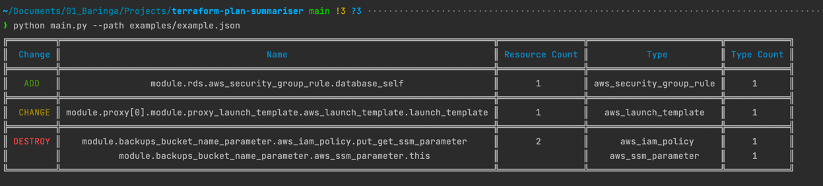

# Terraform Plan Summariser
A Python CLI which summarises a Terraform Plan in an ASCII Table format. We took inspiration from the Go 
application `tf-summarize` [github](https://github.com/dineshba/tf-summarize)

# How to use

```shell
terraform plan -out example.tfplan && terraform show -json example.tfplan > example.json

python main.py --path examples/example.json
```



# Hackathon Team
Ahmed ElRefaey [github](https://github.com/montaro) 

Michael Gant [github](https://github.com/GantZA)