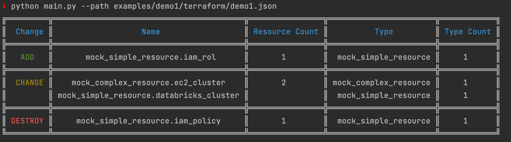

# Demo 1: 
A simple example using mock resources which can be run locally

# How to run

```shell
cd terraform

terraform init

terraform plan -out demo1.tfplan && terraform show -json demo1.tfplan > demo1.json

cd ../../..

python main.py --path examples/demo1/terraform/demo1.json
```


